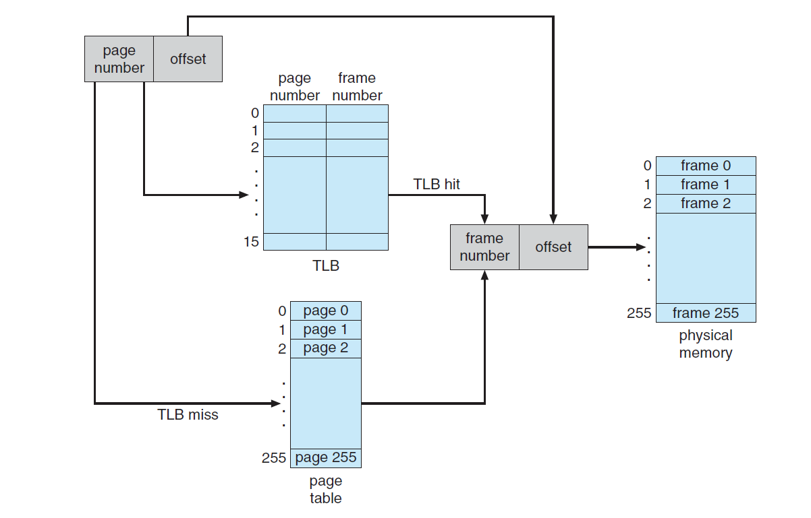

# OS_Project_Virtual_Memory_Manager

# Virtual-Memory-Manager
Designed Virtual Memory Manager which translates logical address to physical address.

This project consists of writing a program that translates logical to physical addresses. This program will read from a file containing logical addresses and using a TLB as well as a page table, will translate each logical address to its corresponding physical address and output the value of the byte stored at the translated physical address. 

### Background & Problem Description:

* The virtual memory manager is simulating the process of logical to physical address translation

* Logical address => Page Number + Offset

* Physical address => Frame Number + Offset

### Steps involved:

* Extract ‘Page Number’ and ‘Offset’ (Logical address)
* Find the corresponding frame number using page number.
* Consult TLB. If there is TLB hit, the frame number is obtained from TLB.
* If there is a TLB miss, consult page table. If there is a page table hit, the frame number is obtained.
* Otherwise, page fault occurs. After handling page fault, restart the process, frame number can be retrieved from TLB.
* Concatenate: ‘Frame Number’ and ‘Offset’ to get the corresponding ‘Physical address’.
* With frame number and offset, data can be extracted from physical memory.

            

To handle the page fault, a BACKING_STORE.bin is consulted. It represent a hard drive which can be accessed randomly. When there is a page fault, data will be found in BACKING_STORE.bin with corresponding page number. The data will be allocated in the physical memory where there is an available frame. After that, TLB and page table will be updated with frame number and page number.

### Configuration:

* 256 entries in the page table
* Page size of 256 bytes
* 16 entries in the TLB
* Frame size of 256 bytes
* 256 frames
* Physical memory of 65,536 bytes (256 frames * 256-byte frame size
* Language: Python 3.6
* Data: integer
* TLB (Translation Lookaside Buffer)& PageTable: List
* Physical Memory: Dictionary
* BackingStore: BinaryFile (BackingStore.bin)
* Input/ Output File: Txt File (address.txt; output.txt)
* Table Update method: LRU(Least Recent Use)

### Result and Analysis: 

* Program displays and stores the following values to output.txt.
* The logical address being translated.
* The corresponding physical address .
* The signed byte value stored at the translated physical address.
* Page-fault rate - The percentage of address references that resulted in page faults.
* TLB hit rate - The percentage of address references that were resolved in the TLB.

### Sample output:

Virtual address: 62493 Physical address: 285 Value: 0

11110100 00011101 ==> 00000001 00011101 ==> 285

* Number of Translated Addresses = 1000
* Page Faults = 244
* Page Fault Rate = 0.244
* TLB Hits = 56
* TLB Hit Rate = 0.056
